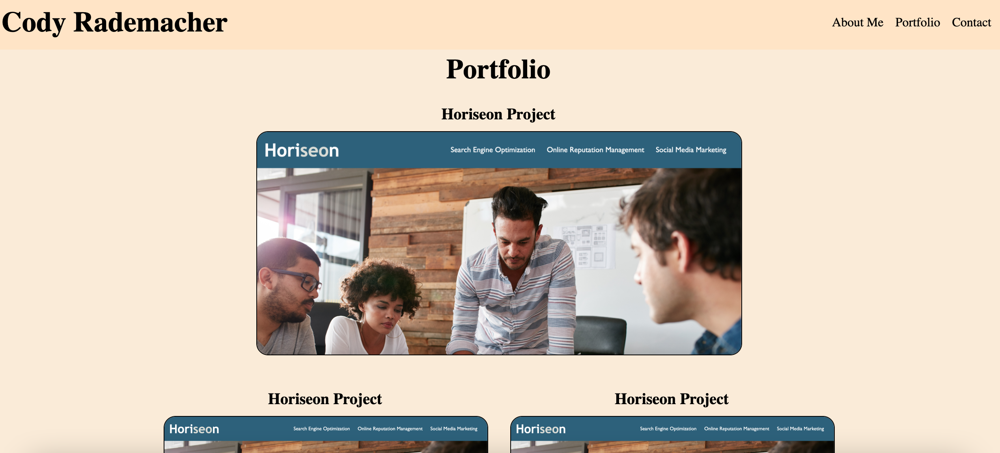

# Codys-Portfolio-Site
Website for my portfolio

## Description

- This project is to showcase who I am, show examples of my past work, and let people know how to contact me.
- I built this project to help showcase my work to future potential employers.
- This project acts as my online profile to anyone who wants to see my experience as a developer.
- I learned how to build and deploy a webpage from scratch.

## Installation

I will install this project using GitHub pages to deploy the website to the internet.

## Screenshots
    
    

    

## License

MIT License

## Features

The first section of my project shows my headshot and my bio.

The second section shows clickable images that take people to deployed projects I have built in the past.

The third and final section shows my contact information for people to get a hold of me.

## Link to deployed application

